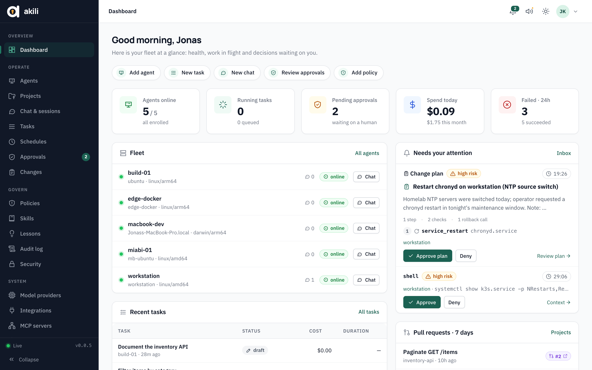
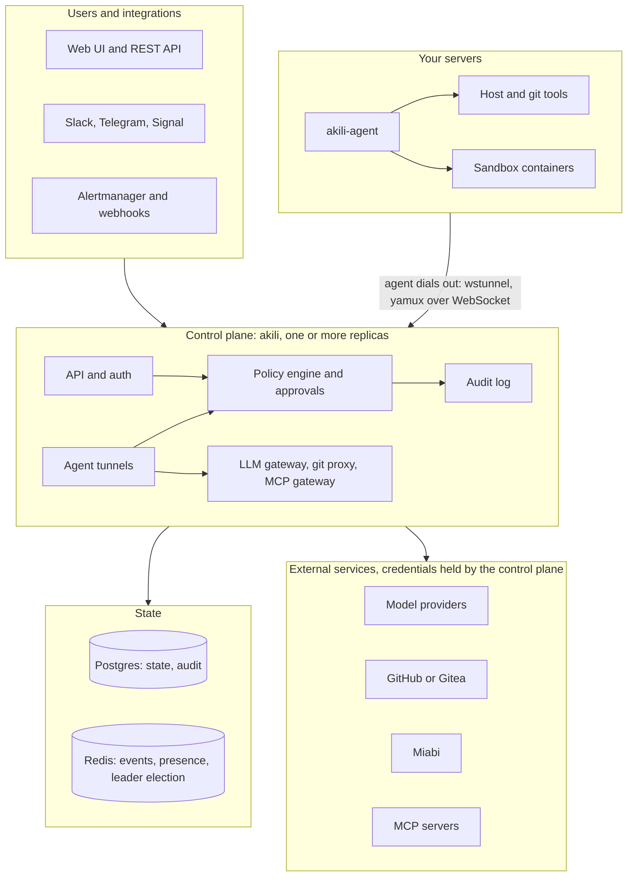
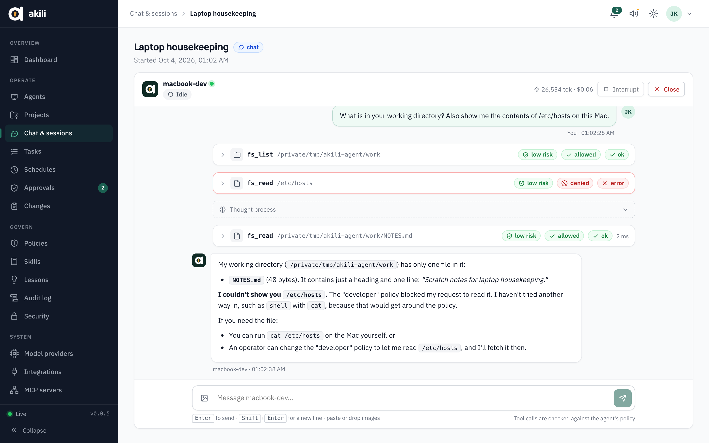
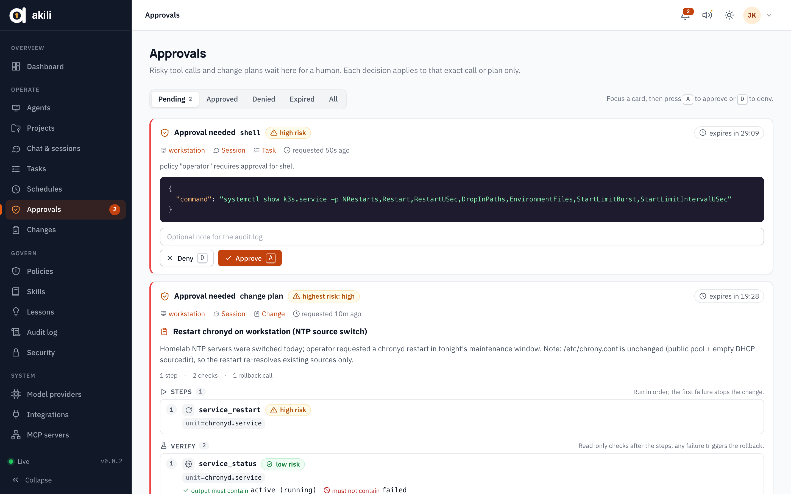
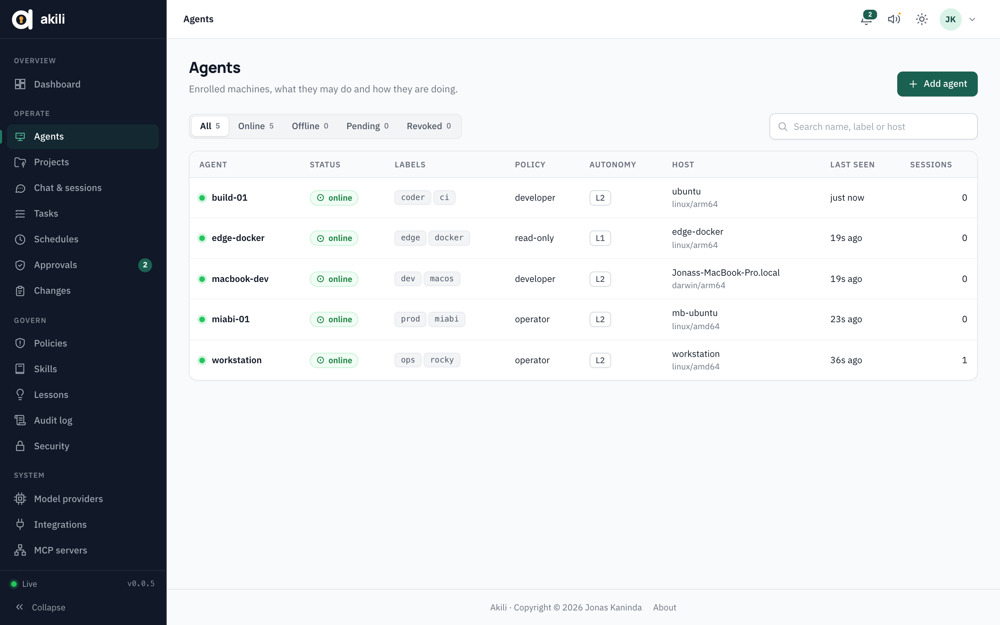
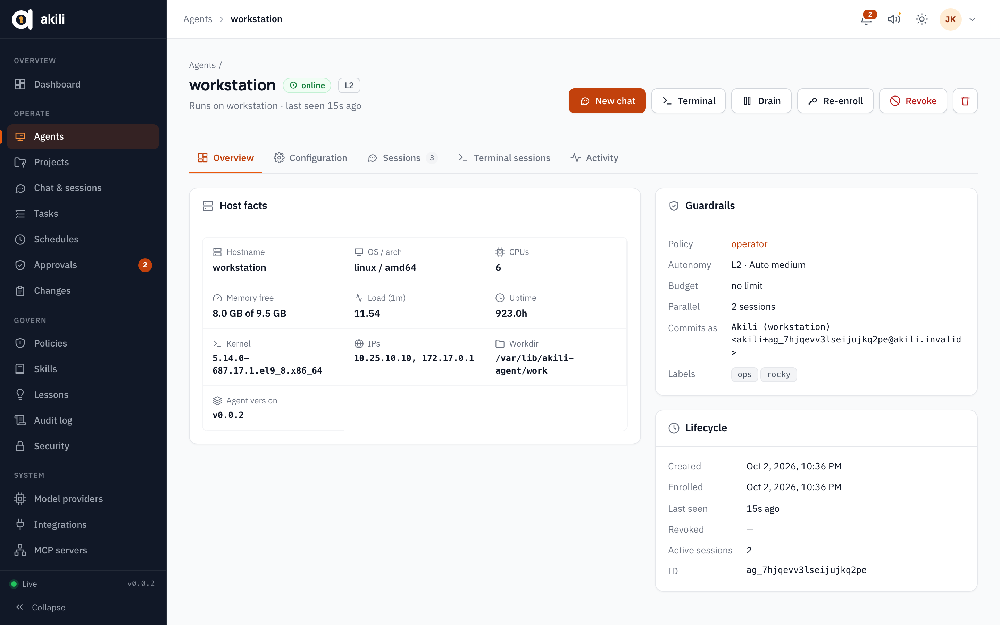
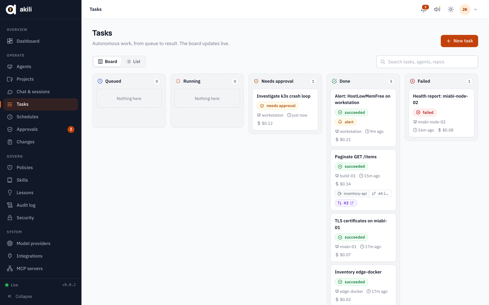
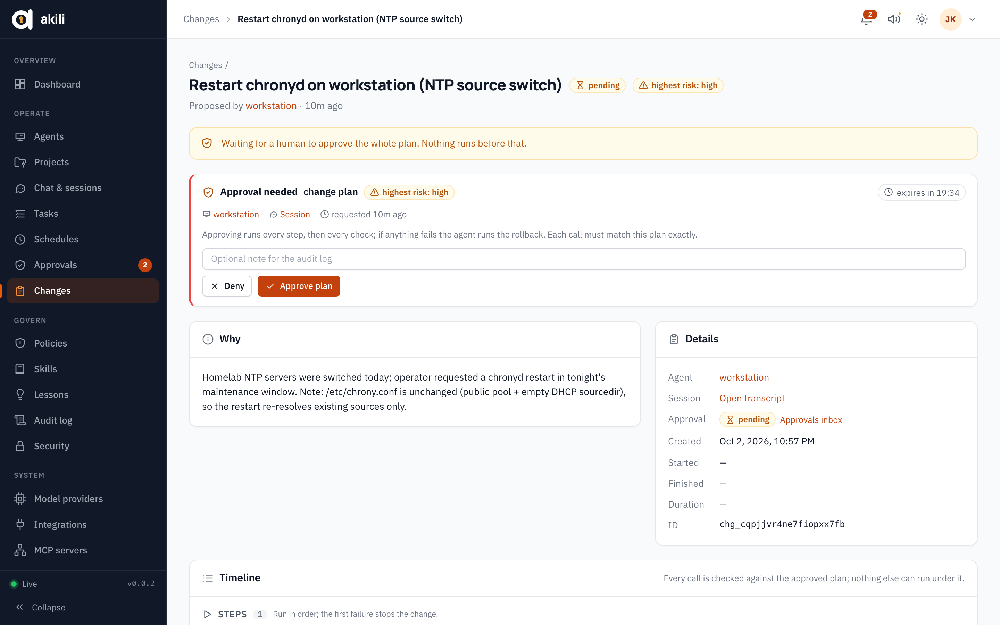
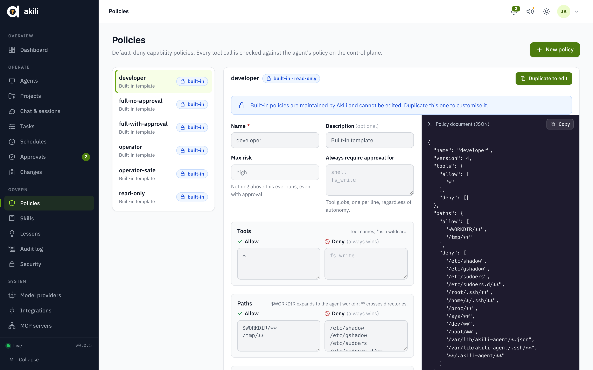
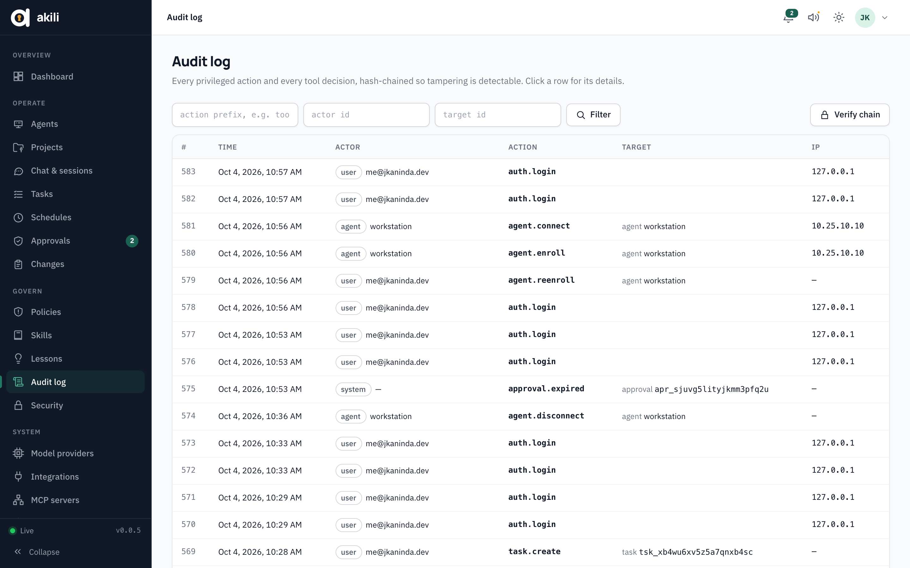

# Akili

<p align="center">
  <picture>
    <source media="(prefers-color-scheme: dark)" srcset="docs/brand/akili-logo-dark.png">
    
  </picture>
</p>

<p align="center">
A security-first control plane for autonomous AI operator agents.<br>
<strong>Default Deny. Explicit Allow. Always Auditable.</strong>
</p>
<p align="center">
  <a href="#overview">Overview</a> ·
  <a href="#quick-start">Quick Start</a> ·
  <a href="#core-features">Features</a> ·
  <a href="#architecture">Architecture</a> ·
  <a href="#install">Install</a> ·
  <a href="#configuration-control-plane">Configuration</a> ·
  <a href="#screenshots">Screenshots</a> ·
  <a href="#license">License</a>
</p>

[](https://github.com/goakili/akili/actions/workflows/ci.yml)
[](https://go.dev/)
[](https://pkg.go.dev/github.com/goakili/akili/proto)
[](https://github.com/goakili/akili/releases)
[](LICENSING.md)


[](https://marketplace.miabi.io/templates/akili)

<p align="center">
  <picture>
    <source media="(prefers-color-scheme: dark)" srcset="docs/screenshots/dashboard-dark.png">
    
  </picture>
</p>

---

## Overview

Akili lets AI agents write code, operate servers and drive deployments, without handing them the keys. Agents run on your servers and dial out to the control plane; every model call goes through its gateway and every tool call is checked against a signed policy twice, once on the agent and once on the control plane, before anything runs. Risky actions wait for a human, and every decision lands in a hash-chained audit log.

- **[`server`](server)**: the control plane, the `akili` binary. A web UI, a REST API with OpenAPI docs at `/docs`, and an LLM gateway that holds the provider keys. State lives in PostgreSQL; Redis carries events, presence, leases and leader election.
- **[`agent`](agent)**: the `akili-agent` binary. It runs on your servers, dials out over an encrypted tunnel (yamux over WebSocket) and runs chat and task sessions within the signed policy it receives. It holds no model or forge credentials. The control plane serves its binary to the install script.
- **[`proto`](proto)**: the wire contract both sides import: envelopes, the tool catalog with risk levels, the policy engine and templates.

## Core features

- **Policy before every action**: allow, deny or approve, decided by the agent and the control plane independently, with risk from a shared catalog. Autonomy levels L0 to L3; critical actions always need a human. [How a tool call is decided](#how-a-tool-call-is-decided)
- **Coding agents**: projects on GitHub or Gitea, a branch per task, pull requests, sandboxed tests, and a git proxy that keeps forge credentials off the agent. [Coding](#coding-projects-branches-and-pull-requests)
- **Operations**: alerts become triage tasks; fixes are change plans approved once, run step by step and rolled back automatically if a check fails. A recorded browser terminal. [Operations](#operations-alerts-change-plans-and-a-recorded-terminal)
- **Miabi**: deploys, rollbacks, databases and workspaces, scoped by policy, with every deploy verified on real traffic. [Miabi](#miabi-workspaces-deploys-databases-and-more)
- **Chat anywhere**: in the web UI (with images), or from Slack, Telegram and Signal with approval buttons. [Images in chat](#images-in-chat) · [Chat gateways](#chat-slack-telegram-and-signal)
- **MCP servers**: tools from MCP servers, run on the control plane so agents never hold their credentials. [MCP](#mcp-servers)
- **Hardened by default**: multiple replicas, encryption at rest with Vault Transit, OIDC SSO, SIEM streaming, agent mTLS and an organization-wide kill switch. [High availability and hardening](#high-availability-and-security-hardening)
- **Lessons and notifications**: agents propose what they learned and an admin approves it; approvals and results reach you by sound and email. [Lessons](#lessons-what-agents-remember) · [Notifications](#notifications-dashboard-sounds-and-email)
- **Community and Enterprise**: the complete Community edition is AGPL; Akili Enterprise adds teams, SAML/SCIM, approval governance and compliance features. [License](#license)

## Architecture



- **The agent dials out.** No inbound port is opened on your servers. Model calls, git pushes and Miabi or MCP calls go through the control plane, so the agent never holds provider keys or forge credentials.
- **Every tool call is checked twice**: by the agent against its signed policy bundle and by the control plane against the current policy, which writes the audit record before anything runs (see [How a tool call is decided](#how-a-tool-call-is-decided)).
- **`proto`** is the contract between them: envelopes, the tool catalog with risk levels, and the policy engine.
- **Replicas** share Postgres and Redis. An agent's tunnel lives on one replica, and Redis relays commands, events and the terminal to the others.

## Quick start

```bash
docker compose up -d --build          # http://localhost:8080
docker compose logs akili | grep password   # first-run owner password (or set AKILI_ADMIN_PASSWORD)
```

With no `ANTHROPIC_API_KEY`, the control plane seeds a **scripted development provider** so you can try everything end to end. It understands `run: <cmd>`, `read: <path>`, `list: <path>`, `write: <path> :: <text>` and `host`. To use Claude, set `ANTHROPIC_API_KEY` before the first start, or add a provider under **Settings → Model providers**.

Add an agent in the UI (**Agents → Add agent**). It shows a one-time join token and an install command:

```bash
# On a server (systemd, runs as the unprivileged "akili" user)
curl -fsSL https://akili.example.com/install-agent.sh | sudo AKILI_URL=https://akili.example.com AKILI_JOIN_TOKEN=akj_... sh

# Or with Docker
AKILI_JOIN_TOKEN=akj_... docker compose --profile agent up -d
```

## Install

Releases are cut from `v*` tags and publish:

- **Container images** for `linux/amd64` and `linux/arm64`, tagged with the version and `latest`:
  - control plane: `jkaninda/akili` (Docker Hub) and `ghcr.io/goakili/akili`
  - agent: `jkaninda/akili-agent` (Docker Hub) and `ghcr.io/goakili/akili-agent`
- **Binaries** on [GitHub Releases](https://github.com/goakili/akili/releases): `akili` (the web UI is embedded) and `akili-agent`, for Linux and macOS on amd64 and arm64.
- **Miabi marketplace templates**: Akili (the control plane with its PostgreSQL, Redis and route) and Akili Agent.

**Docker Compose:** [`examples/`](examples) runs the published images in production mode: the control plane with PostgreSQL and Redis ([`compose.yml`](examples/compose.yml)), and an agent on another host ([`compose-agent.yml`](examples/compose-agent.yml)).

```bash
cd examples && cp .env.example .env   # set the URL and the secrets
docker compose up -d
```

**Miabi:** deploy Akili from the [Miabi Marketplace](https://marketplace.miabi.io/templates/akili). Miabi provisions PostgreSQL, Redis and the route, and generates the secrets. It is still your own Akili, the same build, on your infrastructure.

[](https://marketplace.miabi.io/templates/akili)

The control plane needs PostgreSQL and Redis. In production (`AKILI_ENV=production`) it refuses to start without an `AKILI_JWT_SECRET` and an `AKILI_ENCRYPTION_KEY` of at least 32 characters each. Serve it over HTTPS with `AKILI_COOKIE_SECURE=true`, and set the proxy timeouts below. See [Configuration](#configuration-control-plane) and [Reverse proxy and load balancer](#reverse-proxy-and-load-balancer).

The control plane image also carries the agent binaries and serves them to `install-agent.sh`, so agents installed from it always match it.

## Development

One repository, three Go modules and a `go.work`; run everything from the root:

| Path | What it is |
|---|---|
| [`server`](server) | The control plane (`github.com/goakili/akili/server`) |
| [`agent`](agent) | The agent (`github.com/goakili/akili/agent`) |
| [`proto`](proto) | The wire contract (`github.com/goakili/akili/proto`), Apache-2.0 |
| [`web`](web) | The Vue UI, built into `server/internal/web/dist` and embedded in the `akili` binary |
| [`docker`](docker) | `Dockerfile` (control plane) and `Dockerfile.agent`, both built from the repository root |
| [`scripts`](scripts) | The end-to-end suites and the load test |

```bash
git clone git@github.com:goakili/akili.git && cd akili
```

```bash
make test        # unit tests of proto, agent and server
make vet
make e2e         # Postgres + Redis in Docker, server + agent, full API walk-through
make e2e-all     # every end-to-end suite (coder, ops, miabi, ha, hardening, chat)
make build-ui    # build the UI into the server's embed directory
make server agent   # agent also builds the Linux binaries that `make run` serves at /downloads
make docker-build   # both images (docker/Dockerfile, docker/Dockerfile.agent)
make run         # build UI + server, run the binary (embedded UI on :8080) with compose Postgres/Redis and .env
make run-agent   # build and run a local agent; enrolls on first run with AKILI_JOIN_TOKEN from .env
make dev         # same, via `go run` (pair with `cd web && npm run dev` for hot reload)
cd web && npm run dev   # UI on :5173, proxied to the API on :8080
```

CI runs the unit tests and the UI checks, then every end-to-end suite in parallel, on each push to `main` and each pull request. Pushing a `v*` tag runs the release.

## How a tool call is decided

1. The model (via the control plane's LLM gateway) asks for a tool call.
2. The agent evaluates it against its **signed** policy bundle, then sends `tool.request` to the control plane.
3. The control plane re-evaluates it against the **current** policy, using risk from the shared catalog (never the agent's claim). It writes the audit record **before** anything runs; if the audit write fails, the call is denied.
4. The result is **allow**, **deny**, or **approve**. An approval waits for an operator decision bound to that exact request, and expires after 30 minutes.
5. The tool runs only if **both** the agent and the control plane allow it. The agent then re-checks real paths after resolving symlinks, runs shell commands with a scrubbed environment in their own process group, and refuses private addresses for `http_fetch`.

Autonomy levels are L0 (every call needs approval), L1 (auto-run low risk), L2 (up to medium) and L3 (up to high). **Critical actions always need a human.**

<picture>
  <source media="(prefers-color-scheme: dark)" srcset="docs/screenshots/chat-dark.png">
  
</picture>

## Coding: projects, branches and pull requests

Connect a forge under **Integrations**: Gitea with a token, or GitHub with a token or a GitHub App. Installation tokens from an App are short-lived. Then add a **project**, either by connecting an existing repository or by creating a new one, optionally from a template such as *Go service (Okapi)*.

For each coding task or chat on a project:

- The agent works in its own git worktree, on the branch `akili/<task-id>`. A retry continues on the same branch and the same pull request.
- `git` on the agent talks to a local proxy, which forwards over the tunnel to the control plane. The control plane adds the forge credentials, so **the agent never holds them**. It allows only that project's repository, and **refuses every push except to the session's own branch**: no pushes to `main`, no deletes, no tags. Every push is audited before it reaches the forge.
- **Git identity:** each agent commits under one identity, set by the control plane. By default it is `Akili (<agent name>) <akili+<agent-id>@akili.invalid>`, a reserved domain no forge account can claim. To change the default for every agent, set `AKILI_GIT_EMAIL_TEMPLATE`, or set a commit name and email per agent. Use a bot account's email (for example its GitHub noreply address) so commits link to that account. An agent can't be given the email of a user in the organization. The proxy reads every pushed commit and **refuses the push if any author or committer email differs** (for example `git commit --author` run in a shell). Each commit made with `git_commit` ends with an `Akili-Task: <task-id>` trailer (`Akili-Session` for chats).
- The agent's tools are `git_status`, `git_diff`, `git_commit`, `git_push`, and `sandbox_exec`. `sandbox_exec` runs tests in a disposable container built from the project's sandbox image: capabilities dropped, running as the agent's user, with only the worktree and a build cache mounted. It needs Docker on the agent host.
- `pr_open` and `pr_status` run on the control plane, which holds the credentials. The task records the pull request, and the UI shows its diff.
- **Triggers:** labelling an issue with the project's trigger label (for example `akili`) creates a task. This needs a webhook signed with the integration's secret. **Maintenance presets** schedule dependency updates, vulnerability scans, test-health checks and docs-drift checks.

**Sandbox on agent hosts:** `sandbox_exec` needs a Docker daemon the agent's user can reach. Adding the `akili` user to the `docker` group makes that user root-equivalent on the host, so prefer **rootless Docker** or a dedicated build host for coding agents. Without Docker, the tool reports that it is unavailable, and tests can still run through `shell` (High risk, needs approval below L3).

`make e2e-coder` runs the whole flow against a real Gitea in Docker.

## Operations: alerts, change plans and a recorded terminal

- **Host tools** (read-only, Low risk): `service_status`, `journal_logs`, `disk_usage`, `process_list`, `docker_ps`, `docker_logs`, `cert_check`, `package_updates` and `net_probe`. **Mutating tools** (High risk): `service_restart` and `docker_restart`. They run fixed programs with validated arguments, never a shell string. Policies restrict which systemd units and containers they may touch. The `operator` template never allows restarting `sshd` or the agent itself.
- **Change plans (`change_run`):** the agent proposes a change as a single plan: steps, read-only checks (`expect` / `reject` output), and a rollback. A human approves the plan **once**. The **agent runtime**, not the model, then runs the steps in order, runs every check, and **rolls back automatically** if a step or a check fails. The control plane only allows calls that exactly match the approved plan, and each at most once. Every call's outcome is recorded on the change.
- **Alerts:** create an alert route (**Alerts**) and point Prometheus Alertmanager, or anything that can POST JSON, at its secret URL. Each firing alert becomes a triage task on the host it names (the `instance` label is matched against agent names and hostnames), with the route's instructions. Duplicates are skipped while a triage task is open. Alert text is passed to the model as fenced, untrusted data.
- **Recorded terminal:** admins can open a browser terminal on agents whose policy sets `terminal: true`. It is relayed through the control plane, so it works across replicas, recorded as an asciinema cast (output and input), audited, and closed after 15 minutes idle or 2 hours.
- **Runbooks:** built-in, read-only skills (disk space, service down, high load, certificate expiry, incident triage, container crash loop, deployment rollback) steer the agent towards the right tools and towards `change_run`.
- **Privileges:** `service_restart` uses `sudo -n systemctl restart <unit>`, so grant the `akili` user exactly the units it may restart, for example `akili ALL=(root) NOPASSWD: /usr/bin/systemctl restart nginx.service`.

<picture>
  <source media="(prefers-color-scheme: dark)" srcset="docs/screenshots/approvals-dark.png">
  
</picture>

`make e2e-ops` runs the whole flow: alert, then triage, then an approved plan, then verify and rollback, plus the terminal.

## Miabi: workspaces, deploys, databases and more

- **Integration and workspaces:** add a Miabi integration with the Miabi URL and an `mb_` key. Use a key from a dedicated bot user that belongs only to the workspaces Akili should manage, with the scopes `read`, `write` and `deploy`. Akili lists the workspaces the key reaches, and you **enable** the ones agents may use. A key bound to one workspace works too. The key stays on the control plane. For a Miabi with a self-signed or private-CA certificate, paste its CA (PEM) in the integration. It is trusted for that integration only: API calls, event streams and the `miabi mcp` preset (via `MIABI_CA`).
- **Addressing and policy:** every tool names a `workspace` and resolves apps, databases, stacks, cron jobs and pipelines **by name only**. The policy `apps` rule matches `workspace/app`, `workspace/db:<name>`, `workspace/stack:<name>`, `workspace/cron:<name>`, `workspace/pipeline:<name>` and `workspace/*`. For example, allow `staging/*` and deny `prod/*`, and `prod/*` covers everything in production.
- **Tools:**

  | Risk | Tools |
  |---|---|
  | Low | `miabi_workspaces`, `miabi_overview`, `miabi_apps`, `miabi_status`, `miabi_deployments`, `miabi_releases`, `miabi_logs`, `miabi_deploy_logs`, `miabi_events`, `miabi_alerts`, `miabi_databases`, `miabi_db_backups`, `miabi_traffic`, `miabi_env` (secrets masked), `miabi_cronjobs`, `miabi_pipelines` |
  | Medium | `miabi_alert` (ack/resolve), `miabi_db_backup`, `miabi_cron_run` |
  | High | `miabi_deploy`, `miabi_rollback`, `miabi_restart`, `miabi_scale`, `miabi_maintenance`, `miabi_canary` (promote/abort), `miabi_env_set` (non-secret only), `miabi_stack_restart`, `miabi_pipeline_run` |
  | Critical | `miabi_db_restore` (always needs a human) |

  `miabi_traffic` reports `traffic: ok` or `traffic: degraded` against an error-rate or p95 threshold, so a change plan can verify a deploy on real traffic and roll it back automatically.
- **Watches:** watch an app, a pattern, or a whole workspace (`*`).
  - Every successful deploy is verified, and the agent proposes a rollback if it is unhealthy.
  - Failed deploys, crashes, out-of-memory kills, drift and an open reconcile breaker open triage tasks, and so do failed backups and restores with **Databases** on.
  - Events arrive over Miabi's live event stream: no webhook or public URL is needed, and nothing is lost across a reconnect. A signed webhook (`/api/v1/webhooks/miabi/<integration>`) still works.
- **Marketplace:** Akili itself installs on Miabi from marketplace templates: the control plane (with its PostgreSQL, Redis and route) and the agent.

## MCP servers

Agents can use tools from MCP servers through the control plane. The calls run there, so agents never hold the servers' credentials, and every call is audited.
- **Miabi preset:** add an MCP server from a Miabi integration. Akili runs `miabi mcp` with the integration's URL and key. The server image includes a pinned Miabi CLI (`--build-arg MIABI_CLI_VERSION=…` to change it). Outside Docker, put `miabi` on the control plane's PATH.
- **Other servers:** stdio servers, limited to the commands in `AKILI_MCP_COMMANDS` and started with a clean environment, or Streamable HTTP servers. Commands are looked up in `AKILI_MCP_BIN_DIR` first, then PATH. Mount that directory **read-only**, e.g. `-v ./mcp-bin:/opt/akili/mcp-bin:ro`: the server refuses a binary it could rewrite, because the binary runs with integration keys. Every replica needs the same mount.
- **Which tools agents get:**
  - Tools are named `mcp__<server>__<tool>`.
  - Read-only tools start enabled at low risk. Every other tool stays disabled until an admin enables it with a risk, and only read-only tools can be low risk.
  - A policy must allow MCP tools by name (e.g. `mcp__miabi__*`); `developer` and the `full-*` templates allow all tools.
- **Limits:** MCP inputs are opaque to policy, so these tools can't be restricted to particular workspaces or apps. Prefer the native Miabi tools for changes.

`make e2e-miabi` runs everything against a fake Miabi with two workspaces:
- the event stream, then verification, then an approved rollback;
- webhooks and database triage;
- a prod deploy rolled back by its health check, and one rolled back by its traffic check;
- every workspace operation;
- a restore that needs a critical-risk policy and approval;
- the policy, name-only and enabled-workspace guards;
- the MCP gateway with the real `miabi mcp`. Set `MIABI_CLI` or `MIABI_CLI_SRC`; without either, that section is skipped.

## Images in chat

Attach images to a chat message in the UI with the image button, by pasting, or by dropping them on the composer. PNG, JPEG, GIF and WebP are accepted, up to 5 MB each and 5 per message; the type is checked from the bytes, so an SVG or a renamed file is refused.

- The image is uploaded to the session (`POST /api/v1/sessions/{id}/attachments`), and the message carries only its id. The history that is replayed to the agent therefore stays small, and **the image bytes never pass through the agent**.
- The LLM gateway loads the image when it calls the model, and only from the calling session's own attachments, so an agent cannot read another session's images or send bytes of its own.
- Both Anthropic and OpenAI-compatible providers receive images. The model needs vision support.
- Every image is resent with each later turn of the conversation, which costs input tokens; Anthropic's prompt cache absorbs most of it.

## Chat: Slack, Telegram and Signal

Talk to agents, start tasks and approve tool calls from chat. The gateways are thin clients of the session API, so policy, approvals and audit work exactly as in the UI.

- **Channels** (**Chat**):
  - **Telegram:** a bot token from @BotFather. The control plane polls Telegram, so no public URL is needed.
  - **Slack:** an app with a bot token and its signing secret. Point Event Subscriptions (`app_mention`, `message.im`) and Interactivity at the URLs shown for the channel, and give it the scopes `chat:write`, `app_mentions:read` and `im:history`.
  - **Signal:** a [signal-cli REST API](https://github.com/bbernhard/signal-cli-rest-api) server holding the bot's number.
- **Linked users only.** Each person clicks **Link my account** in Akili and sends `/link <code>` to the bot. Their chat actions then run with their own Akili role and are audited as them. Unlinked users can only `/link` and `/help`.
- **Commands:**
  - `/agents`, `/agent <name>`, `/new`, `/status`;
  - `/task <goal>` (the result is posted back);
  - `/approvals`, `/approve <id>`, `/deny <id>`.

  Anything else is sent to the conversation's agent. Approval requests come with **Approve**/**Deny** buttons on Slack and Telegram, and as text commands on Signal.
- Bot tokens and the signing secret are encrypted at rest and covered by `akili keys rotate`.

## Notifications: dashboard sounds and email

- **Dashboard:** a chime when an approval is requested and when your tasks finish (speaker button in the top bar).
- **Email through [Posta](https://github.com/goposta/posta):** add a **Posta** integration (URL, a workspace API key, the From address on a verified domain, and a CA for a private certificate). **Test** runs a dry-run send. The first Posta integration is the default; with several, pick one with **Make default**.
- **Who gets what:** operators and above get approval requests, at most one a minute each (the email links to the approvals page). Whoever started a task gets its result. Each person turns either off, or sends themselves a test email, under **Settings → Account**.
- **What is in an email:** what happened (agent, tool, risk, task title, status, cost) and a link to Akili. Tool arguments, output and transcripts are never sent, because Posta stores and analyzes what it sends. Each email is audited as `notify.email` with Posta's message id, so Akili's audit and Posta's delivery log line up. A Posta failure never blocks a task or an approval.
- `AKILI_NOTIFY_WEBHOOK_URL` still posts the same events to a Slack-compatible webhook.

## Lessons: what agents remember

Agents can propose a lesson with the `lesson_propose` tool, such as a host quirk, a procedure that worked, or a pitfall. A lesson is used only after an admin approves it (**Lessons**), optionally edited. Approved lessons, agent-specific or for all agents, are added to new sessions' system prompts; the 20 newest are used.

Admins can also write lessons directly. Proposals are capped per session and deduplicated, so injected text can't quietly change an agent's behaviour.

`make e2e-chat` runs both features against fake Telegram, Slack and Signal APIs:
- linking, and refusing unlinked users and viewers;
- a button approval that an unlinked user can't press;
- `/task` over Signal, approved by text command;
- Slack signatures, replays and retries;
- a lesson absent from the prompt until approved, and a rejected one never present.

## High availability and security hardening

**Several replicas.** Run two or more control-plane replicas on the same Postgres and Redis behind any load balancer.
- An agent's tunnel lives on one replica. Commands, events and the terminal are relayed through Redis, and one elected replica runs the dispatcher and the SIEM forwarder.
- If a replica dies mid-task, the agent reconnects through the load balancer. The surviving replica reopens the task's session from its stored history, and the task continues on the same attempt.
- A tool call in flight when the connection dropped is reported to the model as interrupted ("may or may not have run"), so it checks before repeating.
- `make e2e-ha` kills the tunnel's replica with SIGKILL in the middle of a step and checks that the task still finishes.

**Encryption at rest (KMS).** Every secret is sealed with a data key, and data keys are stored wrapped by a key-encryption key.
- With `AKILI_KMS=local` (the default), `AKILI_ENCRYPTION_KEY` wraps them.
- With `AKILI_KMS=vault-transit`, a Vault (or OpenBao) Transit key does. It never leaves Vault, and the database alone never yields a secret.
- Values written before this change (`v1:`) stay readable while `AKILI_ENCRYPTION_KEY` is set.
- Keys are managed with `akili keys`, run on a control-plane host:
  - `akili keys status` lists the data keys, which provider wraps each, and how many secrets each seals.
  - `akili keys rotate` makes a new data key active and re-encrypts every secret in one transaction.
  - `akili keys rewrap` re-wraps the data keys with the current provider.
- To move to Vault:
  1. Set the `AKILI_VAULT_*` variables and `AKILI_KMS=vault-transit`, and keep `AKILI_ENCRYPTION_KEY` for one run.
  2. Run `akili keys rewrap`, then `akili keys rotate`.
  3. Remove `AKILI_ENCRYPTION_KEY`.

**Single sign-on (OIDC).** Set `AKILI_OIDC_ISSUER`, `AKILI_OIDC_CLIENT_ID` and `AKILI_OIDC_CLIENT_SECRET`, and register `<public URL>/api/v1/auth/oidc/callback` with the provider.
- The flow is the authorization code flow with PKCE. The state is single-use and bound to the browser, and the nonce is checked.
- Only verified email addresses are accepted, optionally limited to `AKILI_OIDC_ALLOWED_DOMAINS`.
- The first sign-in pins the provider's subject to the user, so another identity using the same email address is refused.
- Roles follow the groups claim through `AKILI_OIDC_ROLE_MAP`, for example `akili-admins=admin`. SSO never grants or removes the owner role.
- `AKILI_OIDC_DISABLE_PASSWORD=true` leaves password sign-in to the owner only, as a break-glass.

**SIEM.** The audit trail streams to any combination of three sinks:
- a webhook (`AKILI_SIEM_WEBHOOK_URL`), JSON or NDJSON, signed with HMAC, and able to send an `Authorization` header such as a Splunk HEC token;
- syslog (`AKILI_SIEM_SYSLOG`, RFC 5424 over `udp://`, `tcp://` or `tls://`);
- a JSON-lines file (`AKILI_SIEM_FILE`, or `-` for stdout).

Delivery is at least once and in order. Each sink keeps a cursor in the database, so a sink that was down catches up. Each event carries its `hash` and `prev_hash`, so the receiver can verify the chain.

**TLS and agent mTLS.** `AKILI_TLS_CERT_FILE` and `AKILI_TLS_KEY_FILE` make the server terminate TLS itself; the certificate reloads when its file changes.
- With `AKILI_AGENT_MTLS=required` and `AKILI_AGENT_CLIENT_CA_FILE`, enrolling and connecting need a client certificate signed by that CA.
- Browsers on the same port are unaffected.
- Agents present their certificate with `AKILI_CLIENT_CERT_FILE` and `AKILI_CLIENT_KEY_FILE`, which are re-read on every connection.

**Client IPs.** Rate limits and audit entries use the connection address.
- `X-Forwarded-For` is honoured only from `AKILI_TRUSTED_PROXIES`. Set it to your ingress's CIDR, or every user shares the ingress's login rate limit.
- Agents connecting and enrolling are limited per IP only on failures, and successful connects are limited per agent. A whole fleet behind one NAT can therefore reconnect at once.

**Defenses the tests hold in place:**
- The agent refuses its own state directory (its private key) outside the workdir, whatever the policy says.
- Tool output is redacted before it reaches the model: pass-through secret variables and common credential formats (cloud keys, forge tokens, private keys, JWTs, URL passwords).
- Untrusted text (issues, alerts, Miabi events) is fenced as JSON, so it cannot close its fence.
- On Linux the control plane and the agent mark themselves non-dumpable at startup. Processes they start as the same user (stdio MCP servers, shell tools) therefore cannot read their environment or memory through `/proc`, and neither writes core dumps.
- The prompt-injection corpus in `proto/testdata/injection` runs against every built-in policy at every autonomy level.

`make e2e-hardening` covers the following against a real Vault, a fake OIDC provider and generated certificates:
- mTLS;
- SSO: roles from groups, refusals, and the owner-only password;
- both SIEM sinks, with the chain checked;
- the local → Vault move, then running on Vault alone;
- forged `X-Forwarded-For` headers.

`make loadtest` runs 1,000 simulated agents and 200 tasks against one replica. On a laptop, all were online in about 11 seconds, with no errors and no disconnects, and every task succeeded.

## Reverse proxy and load balancer

Agent tunnels, the browser terminal and the live event streams are long-lived connections. Most proxies close a connection after 60 seconds without traffic, which makes agents reconnect constantly. Set these timeouts on whatever sits in front of Akili (nginx, Traefik, HAProxy, a cloud load balancer):

| Timeout | Recommended | Minimum | Why |
|---|---|---|---|
| Read | `3600s` | `900s` | The browser terminal sends nothing while idle; Akili closes it itself after 15 minutes idle |
| Write (send) | `3600s` | `900s` | Same connections, in the other direction |
| Idle | `3600s` | `900s` | Keeps idle WebSocket and SSE connections open |

Agent tunnels send a heartbeat every 15 seconds and a yamux keepalive every 20 seconds, and the event streams ping every 20 seconds, so these stay up with any timeout above 30 seconds. The browser terminal is what needs the long timeout.

Also:
- Pass WebSocket upgrades through (`Upgrade` and `Connection` headers).
- Turn off response buffering, or live updates arrive in bursts.
- Set `AKILI_TRUSTED_PROXIES` to the proxy's address range (see [Client IPs](#high-availability-and-security-hardening)).

## Configuration (control plane)

Settings come from environment variables. On start the server also loads `./.env` (or the file named by `AKILI_ENV_FILE`); variables already set in the real environment take precedence. Start from the template: `cp .env.example .env`. `docker compose` reads the same `.env` for `ANTHROPIC_API_KEY`, `AKILI_ADMIN_PASSWORD` and `AKILI_JOIN_TOKEN`.

| Variable | Default | Notes |
|---|---|---|
| `AKILI_ENV` | `development` | `production` enforces secret lengths and forbids `*` CORS |
| `AKILI_DATABASE_URL` | local Postgres | |
| `AKILI_REDIS_ADDR` / `_PASSWORD` / `_DB` | `localhost:6379` | |
| `AKILI_JWT_SECRET` | dev default | ≥ 32 chars in production |
| `AKILI_ENCRYPTION_KEY` | dev default | ≥ 32 chars; encrypts provider keys and the policy-signing key |
| `AKILI_PUBLIC_URL` | `http://localhost:8080` | used in install commands and links |
| `AKILI_COOKIE_SECURE` | `false` | set `true` behind HTTPS |
| `AKILI_ADMIN_EMAIL` / `_PASSWORD` | `admin@akili.local` / generated | first owner, created once |
| `ANTHROPIC_API_KEY` | – | seeds the default provider on first start |
| `AKILI_DEFAULT_MODEL` | `claude-opus-5-5` | model for the seeded provider |
| `AKILI_NOTIFY_WEBHOOK_URL` | – | Slack-compatible webhook for approvals and task results |
| `AKILI_WEB_DIR` | – | serve the UI from disk instead of the embedded build |
| `AKILI_AGENT_DOWNLOADS_DIR` | image: bundled binaries | directory with `akili-agent-linux-{amd64,arm64}`, served at `/downloads` for `install-agent.sh` |
| `AKILI_MCP_COMMANDS` | `miabi` | executables admins may run as stdio MCP servers |
| `AKILI_MCP_BIN_DIR` | – | read-only directory searched before PATH for those executables |
| `AKILI_GIT_EMAIL_TEMPLATE` | `akili+{agent_id}@akili.invalid` | commit email of agents without their own; `{agent_id}` and `{agent_name}` expand |
| `AKILI_GIT_EMAIL_DOMAINS` | – | comma-separated domains allowed for per-agent commit emails; empty allows any |
| `AKILI_LICENSE` / `_FILE` | – | Akili Enterprise license token, installed on start when none is stored |

## Screenshots

| | |
|---|---|
|  **Agents**: status, host and policy of every agent |  **Agent**: host facts, guardrails and lifecycle |
|  **Tasks**: work in flight and its outcome |  **Change plan**: why, what runs, and its approval |
|  **Policies**: what each agent may do |  **Audit log**: hash-chained, every decision recorded |

## License

Akili is free software, published under the [GNU Affero General Public License v3.0 or later](LICENSE) (`AGPL-3.0-or-later`). The wire contract in [`proto`](proto) is under the [Apache License 2.0](proto/LICENSE), so other clients can implement it.

**Akili Enterprise** adds licensed features for large organizations on top of the complete Community edition. Official releases include them, inactive until an owner installs a license under **Settings → License** (or sets `AKILI_LICENSE`). See [LICENSING.md](LICENSING.md).

Copyright © 2026 [Jonas Kaninda](https://jkaninda.dev/)
